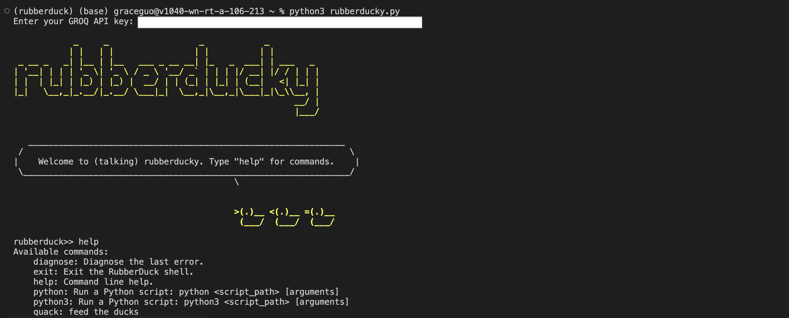
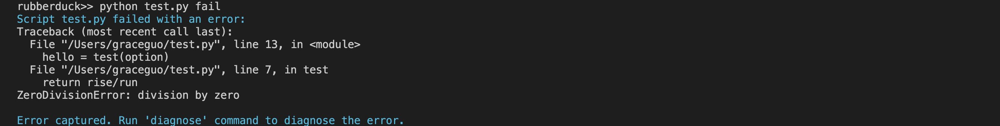
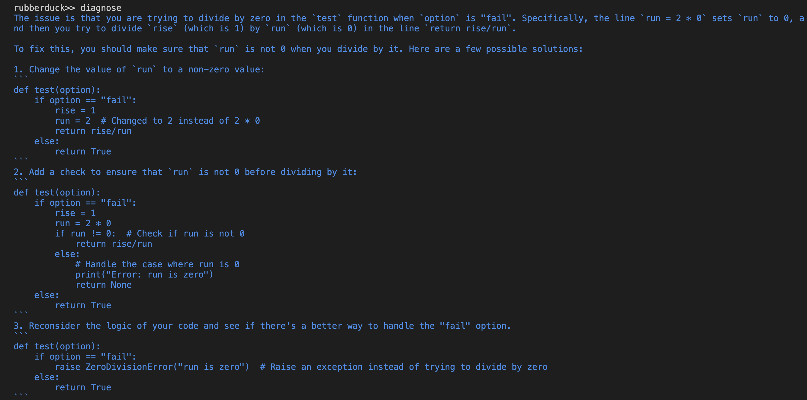
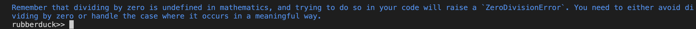

```
            _     _                  _            _          
           | |   | |                | |          | |         
 _ __ _   _| |__ | |__   ___ _ __ __| |_   _  ___| | ___   _ 
| '__| | | | '_ \| '_ \ / _ \ '__/ _` | | | |/ __| |/ / | | |
| |  | |_| | |_) | |_) |  __/ | | (_| | |_| | (__|   <| |_| |   
|_|   \__,_|_.__/|_.__/ \___|_|  \__,_|\__,_|\___|_|\_\\__, |    
                                                        __/ |
                                                        |___/ 
```

# RubberDuck Shell 

```
                >(.)__ <(.)__ =(.)__
                 (___/  (___/  (___/ 
```

RubberDuck Shell is an interactive command-line tool that allows you to run Python scripts, diagnose errors using a variety of LLM models, and execute shell commands. It uses the traceback, and takes relevant code functions as context. Currently the default model is set to `Llama-3-8B`.

## Important Note
This has not been tested extensively. It was a quick fun project and I have not had the time to maintain it!

## Setup

### Prerequisites

- An [GROQ API](https://console.groq.com/docs/quickstart) key: follow the link to setup a GROQ api key

### Installation

1. **Clone the repository**:
    ```bash
    git clone https://github.com/yourusername/rubberduck-shell.git
    cd rubberducky
    ```

2. **Install required Python packages**:
    ```bash
    pip install -r requirements.txt
    ```

## Usage

### Running the Shell

1. **Start the RubberDuck Shell**:
    ```bash
    python rubberduck.py
    ```

2. **Interact with the Shell**:
    - **Get help for commands**:
      ```plaintext
      rubberduck>> help
      ```
    - **Run a Python script**:
      ```plaintext
      rubberduck>> python /path/to/your/script.py arg1 arg2 arg3
      ```
    - **Diagnose the last error**:
      ```plaintext
      rubberduck>> diagnose
      ```
    - **Execute a shell command**:
      ```plaintext
      rubberduck>> ls
      ```
    - **Exit the shell**:
      ```plaintext
      rubberduck>> exit
      ```

## A Simple Example

```python
# test.py

import sys

def test(option):
    if option == "fail":
        rise = 1
        run = 2 * 0
        return rise/run
    else:
        return True

if __name__ == "__main__":
    option = sys.argv[1]
    hello = test(option)
```







## Fun things to do in the future:
- Currently the functionality for providing function code as context only works for .py files (`ast` module). There's a couple ideas here: 
  - a more general purpose parse (ex. `tree-sitter`)
  - having intermediate steps and parse/extract function code using LLMs
- Code completion:
  - Take the solution given by the LLM and have the possibility to inject/replace the problematic code
- Beautify the layout: 
  - creating something like a visual studio code extension? have some basic UI for it rather than a command line interface
